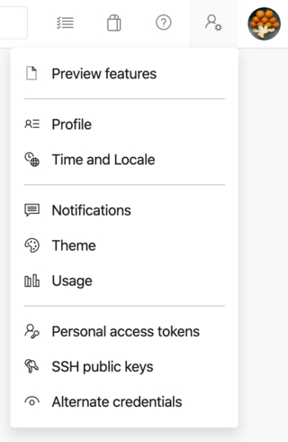

[前回の記事](../2019-10-13-vscode-vim/) で [VSCode/Vim](http://aka.ms/vscodevim) が重くなってしまう件について対処法を調べたが、それでもどうしても重くて厳しかったので自分用に作ってしまった。

作った拡張は [ZenVim](https://marketplace.visualstudio.com/items?itemName=koh110.zenvim) という名前でマーケットに公開したので、作り方と公開の仕方を備忘録にまとめる。

[フィードバック募集中です](https://github.com/koh110/zenvim/issues)

特徴

- Insert Mode ではほぼ VScode と同じ挙動
- `Ctrl + [` で Esc
- yank や paste がクリップボードを共有

# 事前調査

前回みつけた [issue](https://github.com/VSCodeVim/Vim/issues/2021) の中や Stack Overflow などでは代替手段として [Simple Vim](https://marketplace.visualstudio.com/items?itemName=jpotterm.simple-vim) が紹介されていた。

軽快に動くためしばらく利用してみたが、いくつか自分がよく利用するキーバインドが別のキーバインドに割当られていたりした。ex) delete and yank: `dd` -> `rr`

また Macbook Pro に変えてから Esc が押しづらくなり、Vim の Esc を `Ctrl + [` に矯正していたのでこれができないのも辛かった。

自分はそこまで Vim のコマンドを多く利用しないのと、Simple Vim コードを眺めていたら for 文回して毎回 Mode 判定している部分など、よりシンプルにできそうな部分があったので練習の意味を含めて fork ではなく自前で実装することにした。

実際に作り始めようとサンプルコードを探していたら Microsoft が公式で VSCode 拡張の[サンプルを公開している](https://github.com/microsoft/vscode-extension-samples)のを見つけた。この中に [Vim のサンプル](https://github.com/microsoft/vscode-extension-samples/tree/master/vim-sample) もあったので、これを参考にしつつ Visual Mode などを ZenVim として実装した。

余談だが、作るために https://github.com/VSCodeVim/Vim のコードを読んでみたところ、再現を目指しているせいか高度な抽象化が行われてたり内部に自分でマイクロタスクキューを実装していたりと高度すぎる実装でほとんど参考にならなかった。

# Hello World

まずは公式のドキュメントの [get started](https://code.visualstudio.com/api/get-started/your-first-extension) を写経から開始した。

Yeoman を使って VSCode 拡張の generator をインストールする。Yeoman 久々にみた。

```bash
$ npm install -g yo generator-code
```

TypeScript で作成を始めると VSCode API の型が取れるので、ある程度コードを直接追うことでドキュメントで見つけられないような API を見つけやすかった。デフォルトだと TSLint で Lint をされるのがちょっといけてない。

`F5` を押すとデバッグ開始できると書いてあったが、自分はあまりファンクションキーを使わないので、毎回 Command Palette で `Debug: Restart` を打ち込んで実行している。

Debug を開始するとまっさらな VSCode の上に書いた拡張を適用した VSCode が立ち上がってくる。

# 拡張の作り込み

`src/extension.ts` がエントリポイントなのでそこに内部の実装をしていく。(package.json の main プロパティで変更はできそう)

`function activate(context: vscode.ExtensionContext)` が VSCode が立ち上がったときに呼び出されるときのライフサイクルイベントに対する hook になる。

## registerCommand

`vscode.commands.registerCommand(key, handler)` という API で VSCode のイベントに bind できる。

`registerCommand` で返ってくるオブジェクトは activate メソッドの引数に入っている context に必ず push しなければならない。でないとゴミが残るらしい。

```javascript
context.subscriptions.push(vscode.commands.registerCommand('type', e => { ... }))
```

これは何度も登場するのでラッピングする関数を定義しておくとよい。

```javascript
function register(key: string, handler: (...args: any[]) => void) {
  context.subscriptions.push(vscode.commands.registerCommand(key, handler))
}

register('type', e => { ... })
register('cut', () => { ... })
```

## 入力 event hook

[公式のサンプル](https://github.com/microsoft/vscode-extension-samples/tree/master/vim-sample)を眺めてみると `type` というエディタの入力に hook できるイベントがあるので、ここにハンドラを追加するとデフォルトのキー移動を含むキー入力時の挙動を奪える。

Insert Mode のときは `executeCommand` で `default:type` を実行すると通常の VSCode の挙動となる。registerCommand のイベントは型定義されていないようなので、この辺のオブジェクトは実行しながら確認しないとならなかった。

```javascript
context.subscriptions.push(
  vscode.commands.registerCommand('type', e => {
    if (state.mode === Mode.INSERT) {
      // 通常のVSCodeの入力処理
      vscode.commands.executeCommand('default:type', {
        text: e.text
      })
      return
    }

    try {
      // Insert Mode以外のときの挙動
      type(vscode.window.activeTextEditor, e.text)
    } catch (error) {
      console.error(error)
    }
  })
)
```

## Ctrl キーを含む event hook

`type` イベントはブラウザと違って Esc や meta キーの入力を取ることができない。

それらのキー入力をhookしたい場合は package.json の contributes で keybindings プロパティを設定する。

https://github.com/koh110/zenvim/blob/master/package.json#L21

```javascript
  "contributes": {
    "keybindings": [
      {
        "key": "Escape",
        "command": "zenvim.escapeKey",
        "when": "editorTextFocus && !zenvim.mode:normal"
      },
      {
        "key": "ctrl+[",
        "command": "zenvim.escapeKey",
        "when": "editorTextFocus && !zenvim.mode:normal"
      },
      {
        "key": "cmd+c",
        "command": "zenvim.copy",
        "when": "editorTextFocus"
      },
      {
        "key": "ctrl+c",
        "command": "zenvim.copy",
        "when": "editorTextFocus"
      },
      {
        "key": "ctrl+e",
        "command": "zenvim.ctrl+e",
        "when": "editorTextFocus && !zenvim.mode:insert"
      },
      {
        "key": "ctrl+f",
        "command": "zenvim.ctrl+f",
        "when": "editorTextFocus && !zenvim.mode:insert"
      },
      {
        "key": "ctrl+b",
        "command": "zenvim.ctrl+b",
        "when": "editorTextFocus && !zenvim.mode:insert"
      },
      {
        "key": "ctrl+r",
        "command": "zenvim.ctrl+r",
        "when": "editorTextFocus && !zenvim.mode:insert"
      }
    ]
  },
```

この設定で key と comamnd をバインディングできるので、独自コマンドと key を紐付けていく。この時点ではかぶらないような適当なコマンド名をつける。

when で発火するタイミングを調整できるので、上書きしてほしくない Context を外すように設定しておく。ここでは VSCode がデフォルトで持っている Context と独自に設定できる Context がある（例えば editorTextFocus はエディタ領域にフォーカスがある時というContext）

具体的な Context は[ドキュメントに記載されている](https://code.visualstudio.com/docs/getstarted/keybindings#_contexts)

独自 Context を設定したいときは executeCommand で setContext を呼び出す。第2引数が追加する Context 名、第3引数が boolean でその Context を有効にするかどうか。

```javascript
vscode.commands.executeCommand(
  'setContext',
  'zenvim.mode:insert',
  true
)
```

あとは extension.ts に package.json で設定した独自コマンドを vscode.commands.registerCommand で登録して中身を作っていく。

```javascript
context.subscriptions.push(
  vscode.commands.registerCommand('zenvim.escapeKey', e => {
    setMode(Mode.NORMAL)
  })
)
```

## Clipboard

独自のクリップボード機構を作ってもよかったのだけど、なるべくシンプルに保ちたかったので VSCode の Clipboard API を利用することにした。

### copy

copy は簡単で、選択範囲オブジェクトを getText にわたすとテキストが取得できるので、取れたテキストを vscode.env.clipboard.writeText でクリップボードに書き込む。

```javascript
const editor = vscode.window.activeTextEditor

// 選択されているテキストを取得
const text = editor.document.getText(editor.selection)
// clipboard にコピー
vscode.env.clipboard.writeText(text)
```

### cut

cut するときは コピーした内容を削除しなければならないので editor オブジェクトに生えている edit関数の callback に返ってくる editBuilder を利用する。edit関数は非同期で呼び出される。

```javascript
const editor = vscode.window.activeTextEditor

await editor.edit(editBuilder => {
  // copy
  const text = editor.document.getText(editor.selection)
  vscode.env.clipboard.writeText(text)

  // delete
  editBuilder.replace(editor.selection, '')
})
```

### paste

paste は vscode.env.clipboard.readText() で読みだしたテキストをカーソル位置に挿入する。 editorBuilder.insert で場所とテキストを指定すると指定の場所にテキストを挿入できる。

```javascript
const text = await vscode.env.clipboard.readText()
const line = editor.selection.active.line
const character = editor.selection.active.character

await editor.edit(editBuilder => {
  editBuilder.insert(new vscode.Position(line, character), text)
})
```

## Coursor Jump

意外なことに VSCode の API にはカーソルをジャンプする API がない。（上下左右は cursorMove という API がある）

選択範囲の先頭にカーソルを移動する revealRange という API があるので、幅が0の選択範囲をeditorオブジェクトに反映しそのAPIを呼び出す。

よく使うので関数化しておくと楽。

```javascript
export function jumpCursor(
  editor: TextEditor,
  line: number,
  charactor: number
) {
  if (line < 0 || editor.document.lineCount < line) {
    return
  }

  const anchor = new vscode.Position(line, charactor)
  const active = new vscode.Position(line, charactor)

  // jump
  editor.selection = new vscode.Selection(anchor, active)
  editor.revealRange(
    new vscode.Range(line, charactor, line, charactor),
    vscode.TextEditorRevealType.Default
  )
}
```

# マーケットプレイスへ公開

公式のドキュメントは[ここ](https://code.visualstudio.com/api/working-with-extensions/publishing-extension)

npm publish に似た感じで Access Token を使って login 後コマンドから publish する。npm publish と違って token が一定期間で確実に revoke されるので、ここで入手した Token は一生は使えない。

Token につける権限もかなり細かく設定でき、npmに比べて安全になっていてよくできている。

手順を簡単にまとめると下記のようになる。

* [Azure DevOps](https://azure.microsoft.com/services/devops/) にアカウントを作成する
* 拡張機能用のプロジェクトを作成する
* Publish するための Token を取得する
* npm で vsce コマンドをインストールしてログインする
* vsce publish でマーケットプレイスに公開する

## Azure DevOps にアカウントを作成する

特に料金はかからないので Windows のアカウントか GitHub でログインする。

## Publish するための Token を取得する

名前はなんでもいいが `all accessible accounts` を選択しないと Token を入力する段階で `ERROR  Failed request: (401)` となり vsce にログインできないので注意。

https://code.visualstudio.com/api/working-with-extensions/publishing-extension#i-get-403-forbidden-or-401-unauthorized-error-when-i-try-to-publish-my-extension

## Token を取得する

[ドキュメント](https://code.visualstudio.com/api/working-with-extensions/publishing-extension#get-a-personal-access-token)のスクリーンショットは少し古く Security が存在しなかった。

今は Personal Access Token を選択するらしい。



New Token から適当に名前をつけて権限をつける。今回必要な権限は Marketplace の Acquire と Manage の2つ。

Token は絶対に Expiration をつけなればならないらしく、最長でも半年程度で revoke するらしい。

## npm で vsce コマンドをインストールしてログインする

正直グローバルインストールは好きじゃないが、毎回 npx で login もできないのでグローバルにインストールする。

```bash
$ npm install -g vsce
```

create-publisher コマンドでアカウントを作成する。対話式で名前やメールアドレスを聞かれるので入力する。

```bash
$ vsce create-publisher {{publisher名}}
```

さっき作ったコマンドにログインする。

```bash
$ vsce login {{publisher名}}
```

Azure DevOps で作成した Personal Access Token を publisher に紐付ける。

```bash
$ vsce publish -p {{token}}
```

## vsce publish でマーケットプレイスに公開する

`major`, `minor`, `patch` のどれかのバージョンを指定して publish コマンをを実行すると該当のバージョンが上がって publish され、ついでに Git のタグが切られる。

このへんは npm とほとんど一緒だが、バージョンアップと公開が同時にされるのが初回はちょっと驚いた。

```bash
$ vsce publish {{major | minor | patch}}
```

# おわりに

ひさしぶりに新しいプラットフォームにソフトウェアを公開したが、昔に比べて環境が色々と洗練されてきた気がする。

VSCode は API がかなりしっかりしていてドキュメントやサンプルも多く拡張が作りやすかったので、自分にしっくりこない機能はさくっと自作してしまうのがよさそう。
